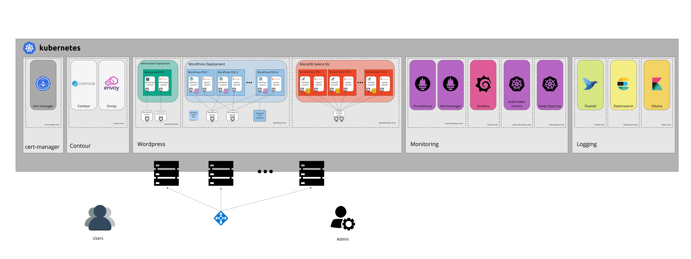

# WordPress for K8s

[Bitnami charts](https://github.com/bitnami/charts) is the easiest way to get started with open-source applications on Kubernetes. It provides you a secure, up-to-date and easy-to-use catalog with 130+ applications.

Most users install the Bitnami charts with the default values, which is a great way to start with your favorite app on K8s using a simple structure. That said, **these charts can offer you much more**. They provide support for different topologies, configurations, integrations, customizations, etc.

This repository is a guide attempts to **unleash the potential of the Bitnami catalog**. To do so, it walks through the steps required to deploy a WordPress site on K8s enabling many of the features you will expect for a production environment such as:

- High Availability (both on WordPress and the database).
- Automatic horizontal scalability.
- Caching database queries and objects.
- Monitoring.
- Log collection & analysis.
- TLS certificates management and issuance.

## TL;DR

```console
$ git clone https://github.com/juan131/wordpress-for-k8s.git && cd wordpress-for-k8s
$ ./setup-wordpress-for-k8s.sh
```

## Before you begin

### Prerequisites

- [Kubernetes](https://kubernetes.io/) 1.12+
- [Helm](https://helm.sh/) 3.1.0
- [Dynamic Volume Provisioning](https://kubernetes.io/docs/concepts/storage/dynamic-provisioning/) support in the underlying infrastructure

### Setup a Kubernetes Cluster & Install Helm

Follow the instruction under the "Before you being" section of the README.md file below:

- [Before you begin](https://github.com/bitnami/charts#before-you-begin).

## How to use this tutorial

This tutorial provides a script ([setup-wordpress-for-k8s.sh](setup-wordpress-for-k8s.sh)) that you can use to deploy all the required solutions in your Kubernetes cluster in a orchestrated way.

As an alternative, you can manually install each of the required charts. The tutorial makes use of the following Helm charts:

- [Bitnami WordPress](https://github.com/bitnami/charts/tree/master/bitnami/wordpress).
- [Bitnami Memcached](https://github.com/bitnami/charts/tree/master/bitnami/memcached).
- [Bitnami MariaDB Galera](https://github.com/bitnami/charts/tree/master/bitnami/mariadb-galera).
- [Bitnami kube-prometheus](https://github.com/bitnami/charts/tree/master/bitnami/kube-prometheus).
- [Bitnami Grafana](https://github.com/bitnami/charts/tree/master/bitnami/grafana).
- [Bitnami Fluentd](https://github.com/bitnami/charts/tree/master/bitnami/fluentd).
- [Bitnami Elasticsearch](https://github.com/bitnami/charts/tree/master/bitnami/elasticsearch).
- [Bitnami Kibana](https://github.com/bitnami/charts/tree/master/bitnami/kibana).
- [Bitnami Nginx Ingress Controller](https://github.com/bitnami/charts/tree/master/bitnami/nginx-ingress-controller).

You can find the corresponding **values.yaml** to deploy each of these charts under the *values/* directory. Those parameters including the comment `# To be customized` are meant to be adapted with your own credentials / preferences.

## The setup

Using this tutorial, the following setup will be deployed in your Kubernetes cluster:



You can find detailed information about how WordPress interact with the rest of the agents on this setup under the [docs directory](docs).
